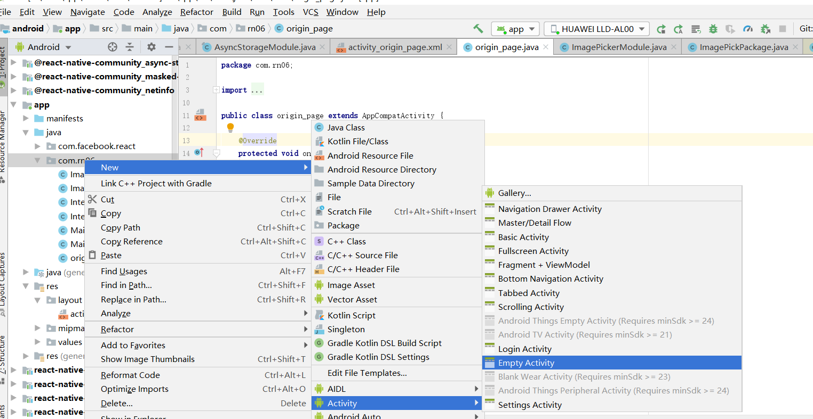
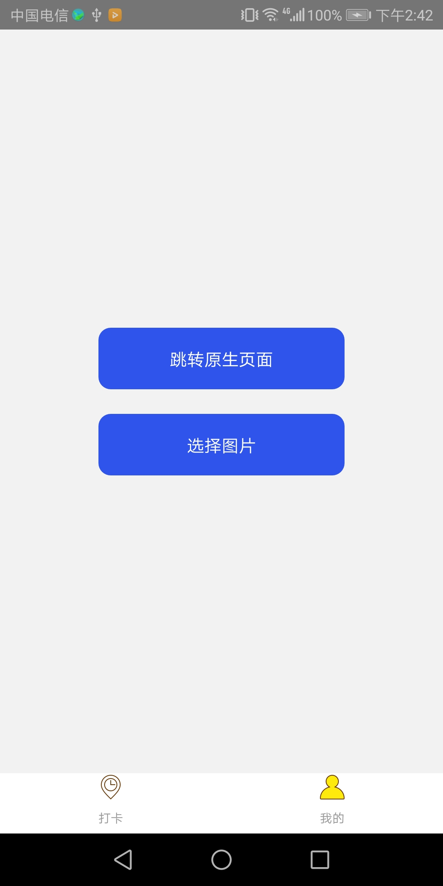
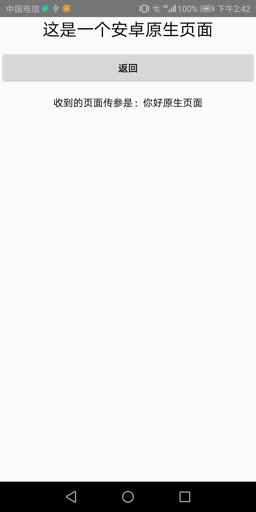

### Rn 跳转原生页面

#### 1. 首先我们在原生工程新建一个 activity 测试
<div align="center"></div>

#### 2. 原生页面布局部分
```
<?xml version="1.0" encoding="utf-8"?>
<LinearLayout xmlns:android="http://schemas.android.com/apk/res/android"
    android:orientation="vertical"
    android:layout_width="match_parent"
    android:layout_height="match_parent"
    >
    <TextView android:id="@+id/origin_text"
        android:layout_width="match_parent"
        android:layout_height="wrap_content"
        android:gravity="center"
        android:textSize="24sp"
        android:text="这是一个安卓原生页面"/>

    <Button
        android:id="@+id/btn_back"
        android:layout_width="match_parent"
        android:layout_height="wrap_content"
        android:layout_marginTop="15dp"
        android:text="返回"/>

    <TextView android:id="@+id/textView_msg"
        android:layout_width="match_parent"
        android:layout_height="wrap_content"
        android:gravity="center"
        android:layout_marginTop="15dp"
        android:textSize="14sp"
        android:text=""/>

</LinearLayout>
```

#### 3.原生活动部分 显示RN 跳转传过来的值  点击返回的时候关闭当前activity
```
package com.rn06;

import androidx.appcompat.app.AppCompatActivity;

import android.content.Intent;
import android.os.Bundle;
import android.view.View;
import android.widget.Button;
import android.widget.TextView;

public class origin_page extends AppCompatActivity {

    @Override
    protected void onCreate(Bundle savedInstanceState) {
        super.onCreate(savedInstanceState);
        setContentView(R.layout.activity_origin_page);
        Button btn_back = (Button) findViewById(R.id.btn_back);
        TextView textView = (TextView) findViewById(R.id.textView_msg);
        Intent intent = getIntent();
        String data = "收到的页面传参是："+ intent.getStringExtra("params");
        textView.setText(data);
        btn_back.setOnClickListener(new View.OnClickListener() {
            @Override
            public void onClick(View view) {
              finish();
            }
        });
    }
}

```

#### 4.新建一个 IntentMoudle 继承 ReactContextBaseJavaModule 暴露给js方法调用

```
package com.rn06;

import android.app.Activity;
import android.content.Intent;
import android.text.TextUtils;

import com.facebook.react.bridge.JSApplicationIllegalArgumentException;
import com.facebook.react.bridge.Promise;
import com.facebook.react.bridge.ReactApplicationContext;
import com.facebook.react.bridge.ReactContextBaseJavaModule;
import com.facebook.react.bridge.ReactMethod;

//  一个原生模块是一个继承了ReactContextBaseJavaModule的 Java 类
public class IntentModule extends ReactContextBaseJavaModule {
    public IntentModule(ReactApplicationContext reactContext) {
        super(reactContext);
    }
//    ReactContextBaseJavaModule要求派生类实现getName方法。这个函数用于返回一个字符串名字，这个名字在 JavaScript 端标记这个模块。
    @Override
    public String getName() {
        return "IntentMoudle";
    }
//    要导出一个方法给 JavaScript 使用，Java 方法需要使用注解@ReactMethod。方法的返回类型必须为void
     @ReactMethod
    public void startActivity(String name, String params){
        try{
            Activity currentActivity = getCurrentActivity();
            if(null!=currentActivity){
                Class toActivity = Class.forName(name);
                Intent intent = new Intent(currentActivity,toActivity);
                intent.putExtra("params", params);
                currentActivity.startActivity(intent);
            }
        }catch(Exception e){
            throw new JSApplicationIllegalArgumentException(
                    "不能打开Activity : "+e.getMessage());
        }
    }


}

```

#### 5.注册模块 新建一个 IntentPackage
```
package com.rn06;

import com.facebook.react.ReactPackage;
import com.facebook.react.bridge.NativeModule;
import com.facebook.react.bridge.ReactApplicationContext;
import com.facebook.react.uimanager.ViewManager;

import java.util.ArrayList;
import java.util.Collections;
import java.util.List;

// 注册模块
public class IntentPackage implements ReactPackage {

    @Override
    public List<ViewManager> createViewManagers(ReactApplicationContext reactContext) {
        return Collections.emptyList();
    }

    @Override
    public List<NativeModule> createNativeModules( ReactApplicationContext reactContext) {
        List<NativeModule> modules = new ArrayList<>();

        modules.add(new IntentModule(reactContext));

        return modules;
    }
}

```

#### 6.在MainApplication添加注册模块  packages.add(new IntentPackage()); 
```
package com.rn06;

import android.app.Application;
import android.content.Context;
import com.facebook.react.PackageList;
import com.facebook.react.ReactApplication;
import com.facebook.react.ReactNativeHost;
import com.facebook.react.ReactPackage;
import com.facebook.soloader.SoLoader;
import java.lang.reflect.InvocationTargetException;
import java.util.List;

public class MainApplication extends Application implements ReactApplication {

  private final ReactNativeHost mReactNativeHost =
      new ReactNativeHost(this) {
     

        @Override
        protected List<ReactPackage> getPackages() {
          @SuppressWarnings("UnnecessaryLocalVariable")
          List<ReactPackage> packages = new PackageList(this).getPackages();
          // Packages that cannot be autolinked yet can be added manually here, for example:
          // packages.add(new MyReactNativePackage());
          ++  packages.add(new IntentPackage());
         
          return packages;
        }

      };


 
}

```
#### 7. RN  端调用

```
  import { NativeModules} from 'react-native';

  NativeModules.IntentMoudle.startActivity("com.rn06.origin_page","你好原生页面")


```

#### 8.效果展示
<div align="center"></div>
<div align="center"></div>