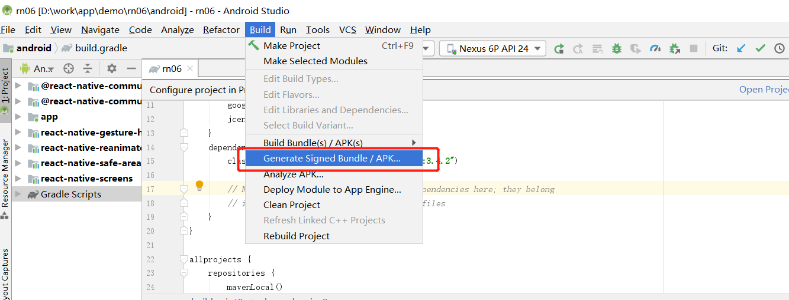
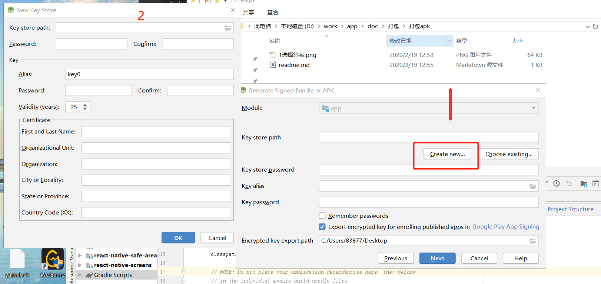
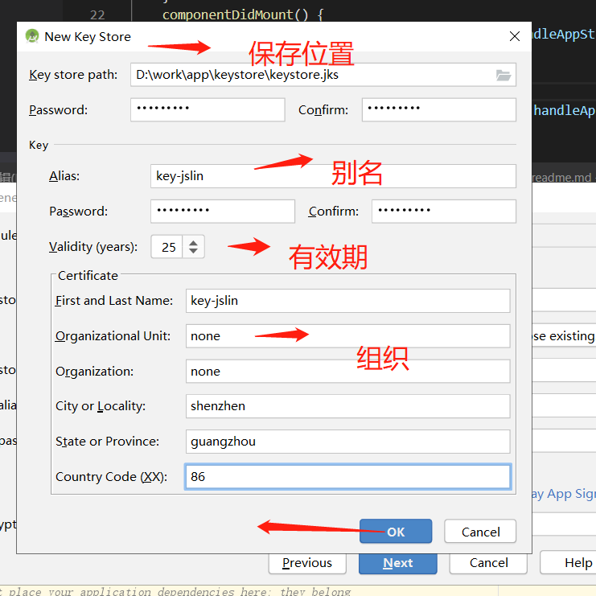
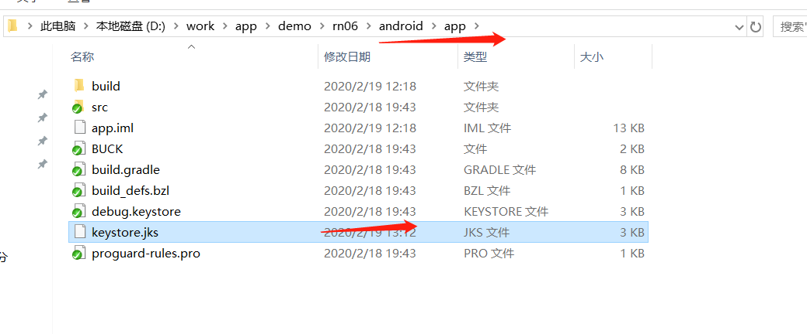
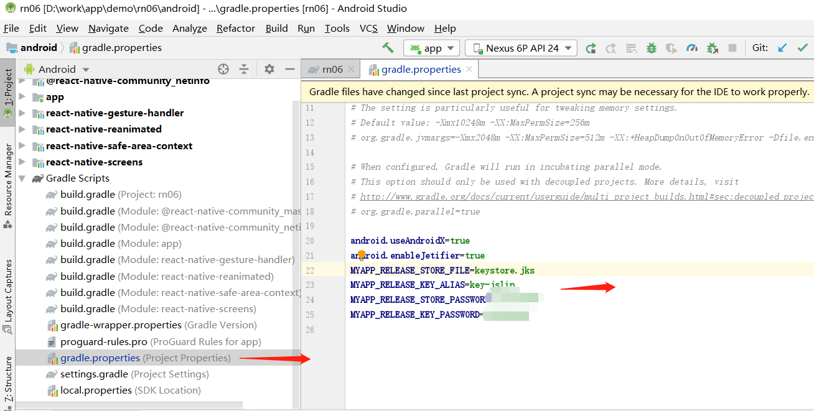
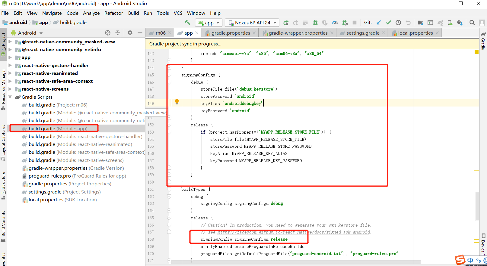
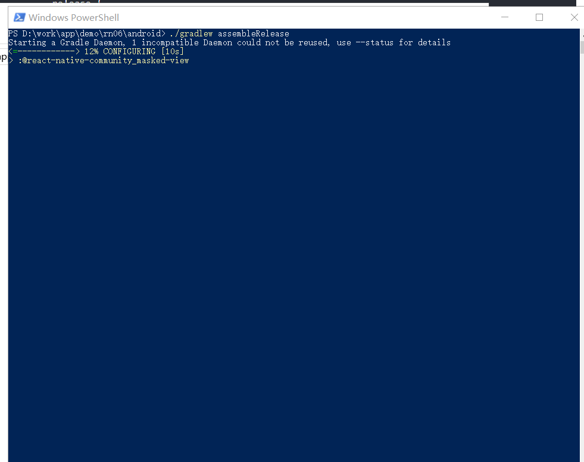
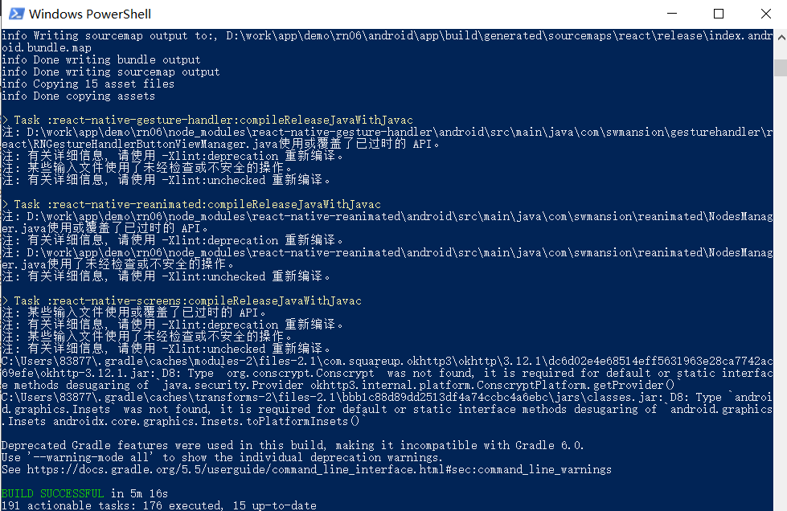
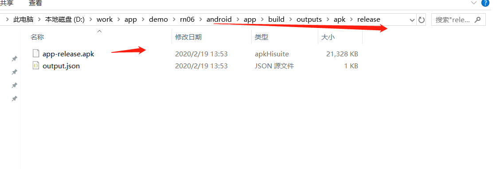

### 生成APK
[官网参考](https://reactnative.cn/docs/signed-apk-android/)


#### 这里演示用 android studio 生成签名秘钥
当然你也可以用 keytool工具
```
$ keytool -genkeypair -v -keystore my-release-key.keystore -alias my-key-alias -keyalg RSA -keysize 2048 -validity 10000
```


 **1. 选择签名**
<div align="center"></div>


 **2. 新建签名秘钥**
<div align="center"></div>


 **3. 填写秘钥信息**
<div align="center"></div>


 **4. 把生成好的storekey拷贝到 android/app 目录下**
<div align="center"></div>


 **5. 配置grandle变量**
 ```
 MYAPP_RELEASE_STORE_FILE=你的keystore名.keystore
 MYAPP_RELEASE_KEY_ALIAS=别名
 MYAPP_RELEASE_STORE_PASSWORD=***** 密码
 MYAPP_RELEASE_KEY_PASSWORD=***** 密码
 ```
<div align="center"></div>


 **6. 把签名配置加入到项目的grandle配置中**
 ```
 ...
android {
    ...
    defaultConfig { ... }
    signingConfigs {
        release {
            if (project.hasProperty('MYAPP_RELEASE_STORE_FILE')) {
                storeFile file(MYAPP_RELEASE_STORE_FILE)
                storePassword MYAPP_RELEASE_STORE_PASSWORD
                keyAlias MYAPP_RELEASE_KEY_ALIAS
                keyPassword MYAPP_RELEASE_KEY_PASSWORD
            }
        }
    }
    buildTypes {
        release {
            ...
            signingConfig signingConfigs.release
        }
    }
}
...
 ```
<div align="center"></div>


 **7. 运行打包命令**
 ```
 $ cd android
 $ ./gradlew assembleRelease
 ```
 `
  译注：
       cd android表示进入 android 目录（如果你已经在 android 目录中了那就不用输入了）。./gradlew assembleRelease在 macOS、Linux 或是 windows 的 PowerShell 环境中表示执行当前目录下的名为 gradlew 的脚本文件，且其运行参数为 assembleRelease，注意这个./不可省略；而在 windows 的传统 CMD 命令行下则需要去掉./。
 `
<div align="center" ></div>


 **8. 打包成功**
<div align="center"></div>


 **9. 生成包文件目录 在 android/app/build/outputs/apk/release**

<div align="center"></div>


