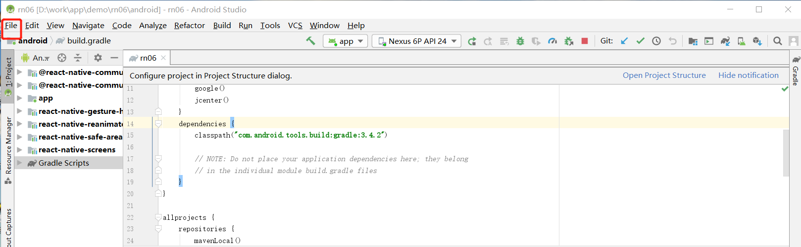
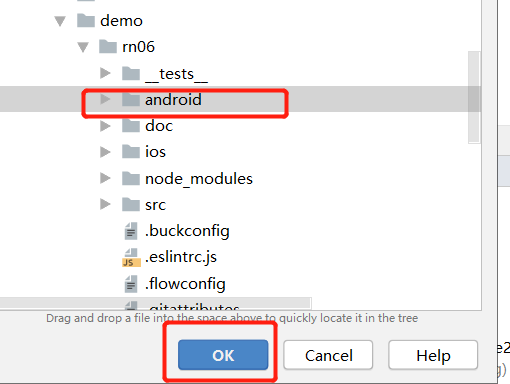
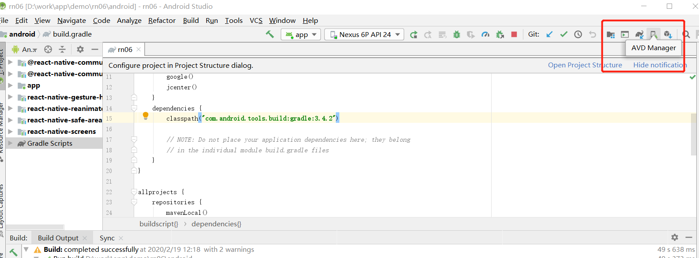
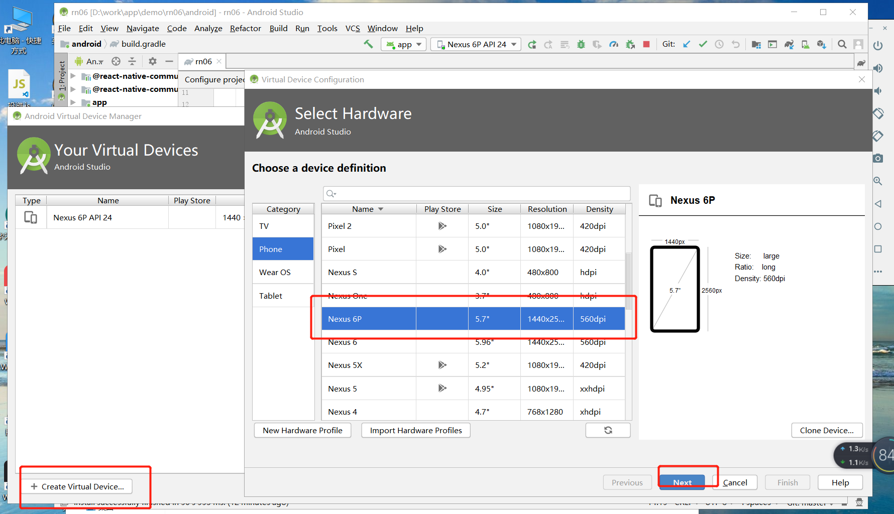
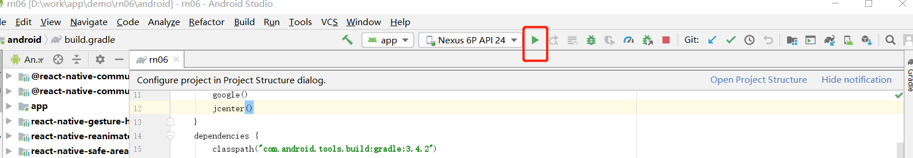
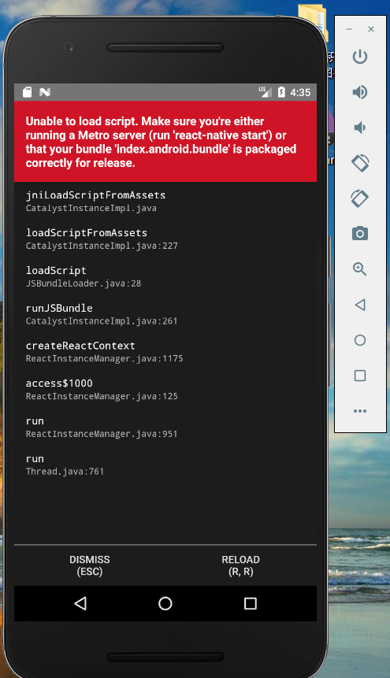
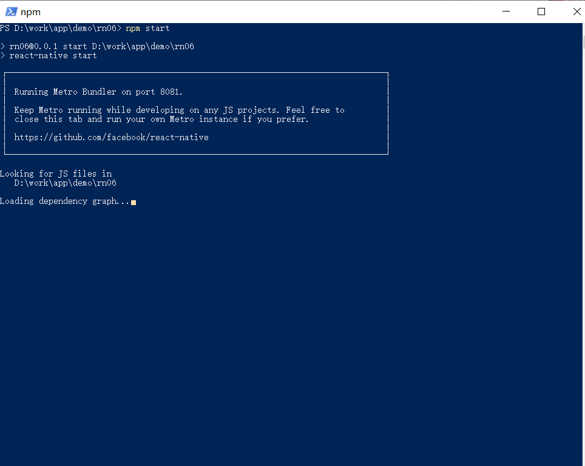
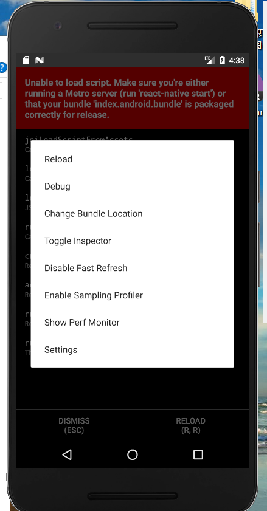
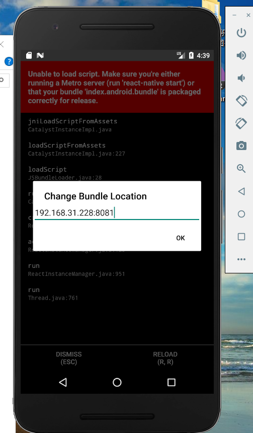
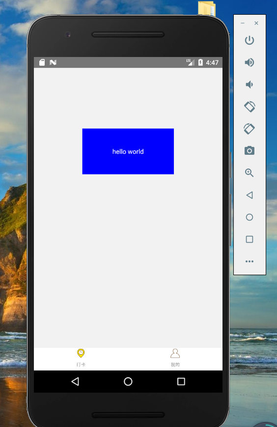

### android 模拟器调试
 **1. 用android studio打开工程**

 **2. 选择要打开的工程文件目录**

 **3. 新建一个模拟器或者真机跑 这里演示模拟器**

 **4. 选择创建模拟器机型**

 **5. run运行到模拟器**

 **6. 运行模拟器示意**

 **7. 启动服务**

 **8. ctrl+m设置bundlesJs地址**

 **9. 设置本地地址加端口号**

 **10. 运行效果**

