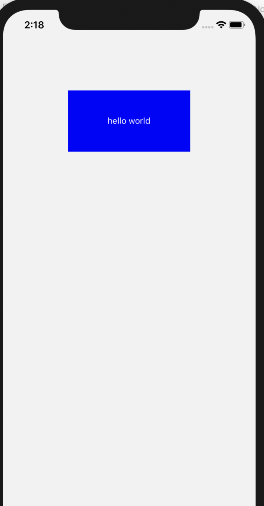

### mac环境搭建 
[官网参考](https://reactnative.cn/docs/getting-started.html)

### 安装依赖
Node Xcode  Watchman

### 安装脚手架
```
yarn  global add react-native-cli
```
### 创建一个项目
```
 react-native init MyApp --version
 例如：react-native init MyApp --@0.61.5
```
### 运行项目
```
cd MyApp
react-native run-ios
```
或者打开xcode 直接运行
<div align="center"></div>

